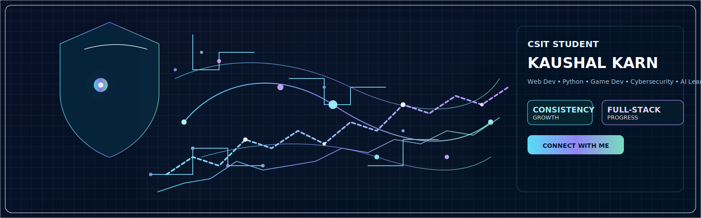

<h1 align="center">
  
</h1>

    
  

    
  

---

<h2 align="center">
  
</h2>

<ul>
  <li>🔍 Highly curious about <b>AI, automation, Python & C/C++, embedded systems, and cybersecurity</b></li>
  <li>🧠 Focused on <b>learning, experimenting, and building smart, practical solutions</b></li>
  <li>💡 Skilled in leveraging <b>AI tools, programming, electronics, and Django</b> for innovative projects</li>
  <li>⚡ Constantly improving <b>problem-solving, coding, analytical, and full-stack development skills</b></li>
</ul>

---

<h2 align="center">
  
</h2>

  
  
  
  

<!-- ---

<h2 align="center">
  
</h2>

### **Most Used Languages**

---

### **GitHub Trophies**

--- -->

<h2 align="center">
  
</h2>

  <!-- Website -->
 

  <!-- YouTube -->
  

  <!-- Twitter/X -->
  

  <!-- Email -->
  

  <!-- GitHub -->
  

