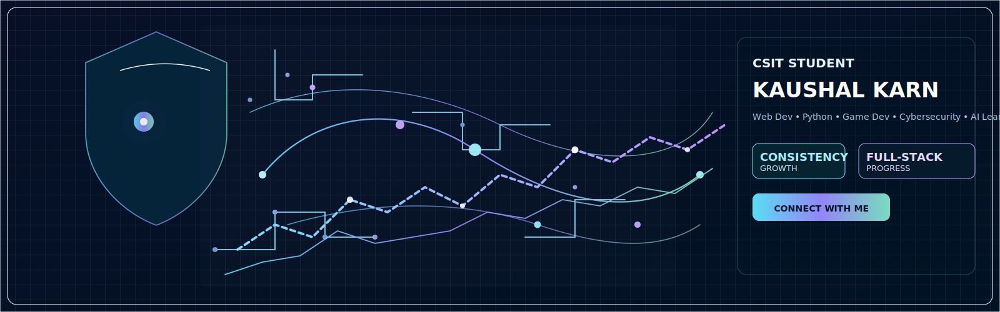

# <div align="center">Hi 👋, I'm Kaushal Karn</div>

<div align="center">



</div>

<div align="center">

# 💻 Computer Science Student • Software Developer • AI & Cybersecurity Enthusiast


</div>

---

# 🌐 Connect With Me

<p align="center">

<a href="https://kaushal-karna.github.io/portfolio-2026/">

</a>

<a href="https://github.com/kaushal-karna">

</a>

<a href="https://www.youtube.com/@kaushalkarnakayansh839">

</a>

<a href="mailto:kkarn02977@gmail.com">

</a>

</p>

---

# 👨‍💻 About Me

```yaml
Name: Kaushal Karn

Location: Nepal 🇳🇵

Education:
  BSc.CSIT

Interested In:
  - Software Development
  - ASP.NET Core
  - Django
  - AI & Machine Learning
  - Cybersecurity
  - Embedded Systems

Currently Learning:
  - C#
  - ASP.NET Core
  - JavaScript
  - Data Structures & Algorithms

Goal:
  Become a Full Stack Software Engineer
```

---

# 🚀 Tech Stack

<p align="center">


</p>

---

# 🛠 Tools

<p align="center">


</p>

---

# 📌 Featured Projects

| Project                   | Description                   | Tech                  |
| ------------------------- | ----------------------------- | --------------------- |
| 🎵 Advance Spotify        | Spotify-inspired music player | HTML, CSS, JavaScript |
| 🌐 Portfolio Website      | Personal developer portfolio  | HTML, CSS, JavaScript |
| 📚 C# Learning Repository | C# practice & OOP concepts    | C#, .NET              |
| 🤖 Face Attendance System | AI attendance project         | Python, OpenCV        |
| 🌱 Django Projects        | Web applications              | Django                |

---

# 📊 GitHub Analytics

<p align="center">


</p>

<p align="center">


</p>

---

# 📈 Activity Graph

<p align="center">


</p>

---

# 🏆 GitHub Trophies

<p align="center">


</p>

---

# 💻 Most Used Languages

<p align="center">


</p>

---

# 📈 GitHub Summary

<p align="center">


</p>

---

# 🌱 Currently Learning

* ASP.NET Core
* C#
* Django
* REST APIs
* Data Structures & Algorithms
* Computer Networks
* Operating Systems

---

# 🎯 2026 Goals

* Build production-ready ASP.NET Core projects
* Master Django backend development
* Solve 300+ DSA problems
* Contribute to Open Source
* Learn Docker
* Learn Kubernetes
* Build AI-powered applications

---

# 📊 Profile Views

<p align="center">


</p>

---

# 💡 Developer Quote

> "The best way to learn programming is by building projects."

---

# 🤝 Let's Connect

<p align="center">

If you like my work, consider following me ⭐

I'm always open to collaborating on interesting projects.

</p>

---

<div align="center">

### Thanks for visiting my profile ❤️

</div>
