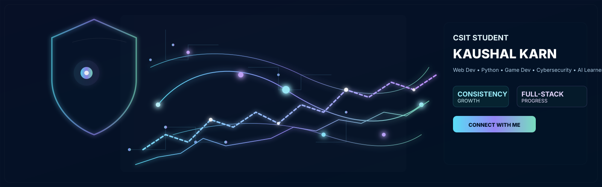

<!-- # Hi 👋, I'm Kaushal Karn



## 💻 Computer Science Student • Software Developer • AI & Cybersecurity Enthusiast

![Typing Banner][typing-banner]

---

## 🌐 Connect With Me

[](https://kaushal-karna.github.io/portfolio-2026/)

[](https://github.com/kaushal-karna)

[](https://www.youtube.com/@kaushalkarnakayansh839)

[](mailto:kkarn02977@gmail)

---

## 👨‍💻 About Me

```yaml
Name: Kaushal Karn
Location: Nepal 🇳🇵
Education:
  BSc.CSIT
Interested In:
  - Software Development
  - ASP.NET Core
  - Django
  - AI & Machine Learning
  - Cybersecurity
  - Embedded Systems
Currently Learning:
  - C#
  - ASP.NET Core
  - JavaScript
  - Data Structures & Algorithms
Goal:
  Become a Full Stack Software Engineer
```

---

## 🚀 Tech Stack

![Tech Stack][tech-stack]

---

## 🛠 Tools

![Tools][tools]

---

## 📌 Featured Projects

| Project | Description | Tech |
| --- | --- | --- |
| 🎵 Advance Spotify | Spotify-like music player | HTML, CSS, JavaScript |
| 🌐 Portfolio Website | Personal portfolio | HTML, CSS, JavaScript |
| 📚 C# Learning Repository | C# practice projects | C#, .NET |
| 🤖 Face Attendance System | AI attendance project | Python, OpenCV |
| 🌱 Django Projects | Web applications | Django |

---

## 📊 GitHub Analytics

![GitHub Stats][github-stats]

![Top Languages][top-langs]

![Streak Stats][streak-stats]

---

## 📈 Activity Graph

![Activity Graph][activity-graph]

---

## 💻 Most Used Languages

![Repos per Language][repos-per-language]

![Most Commit Language][most-commit-language]

---

## 📈 GitHub Summary

![Profile Details][profile-details]

---

## 🌱 Currently Learning

- ASP.NET Core
- C#
- Django
- REST APIs
- Data Structures & Algorithms
- Computer Networks
- Operating Systems

---

## 🎯 2026 Goals

- Build production-ready ASP.NET Core projects
- Master Django backend development
- Solve 300+ DSA problems
- Contribute to Open Source
- Learn Docker
- Learn Kubernetes
- Build AI-powered applications

---

## 📊 Profile Views

![Profile Views][profile-views]

---

## 💡 Developer Quote

> "The best way to learn programming is by building projects."

---

## 🤝 Let's Connect

If you like my work, consider following me ⭐

I'm always open to collaborating on interesting projects.

---

Thanks for visiting my profile ❤️

[typing-banner]: https://readme-typing-svg.demolab.com?font=Poppins&weight=600&size=24&duration=3500&pause=1000&color=0A84FF&center=true&vCenter=true&width=700&lines=Computer+Science+Student;Software+Developer;Learning+ASP.NET+Core+%26+Django;AI+%7C+Cybersecurity+%7C+Embedded+Systems;Always+Building+Something+New
[tech-stack]: https://skillicons.dev/icons?i=cpp,c,cs,dotnet,python,django,js,html,css,bootstrap,git,github,vscode,mysql,sqlite,linux,wordpress
[tools]: https://skillicons.dev/icons?i=visualstudio,vscode,git,github,linux,mysql,sqlite
[github-stats]: https://kaushal-github-stats.vercel.app/api?username=kaushal-karna&show_icons=true&theme=transparent&hide_border=true&rank_icon=github&include_all_commits=true
[top-langs]: https://kaushal-github-stats.vercel.app/api/top-langs/?username=kaushal-karna&layout=compact&theme=transparent&hide_border=true
[streak-stats]: https://streak-stats.demolab.com?user=kaushal-karna&theme=transparent&hide_border=true
[activity-graph]: https://github-readme-activity-graph.vercel.app/graph?username=kaushal-karna&theme=github-compact&hide_border=true
[repos-per-language]: https://github-profile-summary-cards.vercel.app/api/cards/repos-per-language?username=kaushal-karna&theme=github_dark
[most-commit-language]: https://github-profile-summary-cards.vercel.app/api/cards/most-commit-language?username=kaushal-karna&theme=github_dark
[profile-details]: https://github-profile-summary-cards.vercel.app/api/cards/profile-details?username=kaushal-karna&theme=github_dark
[profile-views]: https://komarev.com/ghpvc/?username=kaushal-karna&style=for-the-badge&color=0e75b6 -->


Hi 👋, I'm Kaushal Karn

<p align="center">
  
</p>

<p align="center">
  <a href="https://kaushal-karna.github.io/portfolio-2026/">
    
  </a>
  <a href="https://github.com/kaushal-karna">
    
  </a>
  <a href="https://www.youtube.com/@kaushalkarnakayansh839">
    
  </a>
  <a href="mailto:kkarn02977@gmail.com">
    
  </a>
</p>

<p align="center">
  
</p>

👨‍💻 About Me

I'm a BSc.CSIT student focused on Python and Django backend development, with hands-on experience building database-driven web applications and REST APIs.

🐍 Python & Django backend development

🚀 Django REST Framework and REST APIs

🗄️ MySQL, SQLite and Oracle DB

🔐 Authentication and JWT

🌱 Currently learning ASP.NET Core, C# and advanced backend development

🧠 Practising Data Structures & Algorithms

🛠️ Interested in AI, cybersecurity and embedded systems

📍 Biratnagar, Nepal

📄 View my resume

🧰 Tech Stack

<p align="center">
  
</p>

🚀 Featured Projects

🎵 Advance Spotify

A Spotify-inspired web project focused on a responsive music-streaming interface and interactive UI.

🌐 Portfolio Website

My personal developer portfolio showcasing my projects, skills, resume and GitHub activity.

📚 C# Learning Repository

A learning repository for practising C# concepts and building a stronger foundation for .NET development.

🧑‍💻 Face Attendance System

A computer-vision based attendance project focused on automating attendance workflows.

🌐 Django Projects

A collection of Django projects for practising backend architecture, database operations, authentication and web application development.

📚 Current Learning

ASP.NET Core

C#

Django & Django REST Framework

REST API development

Data Structures & Algorithms

Computer Networks

Operating Systems

Docker & Kubernetes

🎯 2026 Goals

🚀 Build production-ready ASP.NET Core applications

🐍 Strengthen Django backend development

🧠 Complete 300+ DSA problems

🤝 Contribute to open-source projects

🐳 Learn Docker and Kubernetes deeply

🤖 Build practical AI-powered applications

💼 Gain real-world software development experience

📊 GitHub Analytics

<p align="center">
  
</p>

<p align="center">
  
</p>

<p align="center">
  
</p>

📈 Activity Graph

<p align="center">
  
</p>

💻 Most Used Languages

<p align="center">
  
  
</p>

📈 GitHub Summary

<p align="center">
  
</p>

📊 Profile Views

<p align="center">
  
</p>

📄 Resume

<p align="center">
  <a href="resume.html">🌐 View Resume</a> •
  <a href="assets/Kaushal_Karn_CV.pdf">📥 Download PDF Resume</a>
</p>

🤝 Let's Connect

<p align="center">
  <a href="mailto:kkarn02977@gmail.com">📧 Email</a> •
  <a href="https://github.com/kaushal-karna">🐙 GitHub</a> •
  <a href="https://www.youtube.com/@kaushalkarnakayansh839">▶️ YouTube</a> •
  <a href="https://kaushal-karna.github.io/portfolio-2026/">🌐 Portfolio</a>
</p>

💡 “Keep learning, keep building, and turn ideas into useful software.”